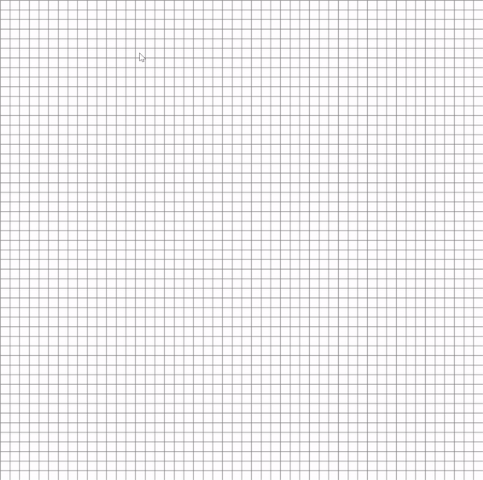

# Path Finding - A*

KEYS:  
Left mouse click = the first click marks the START point, the second click marks the END point and every following click is a barrier  
Right mouse click = clear this point    
SPACE = RUN the algorithm     

  

## About A* Search Algorithm
https://www.geeksforgeeks.org/a-search-algorithm/

