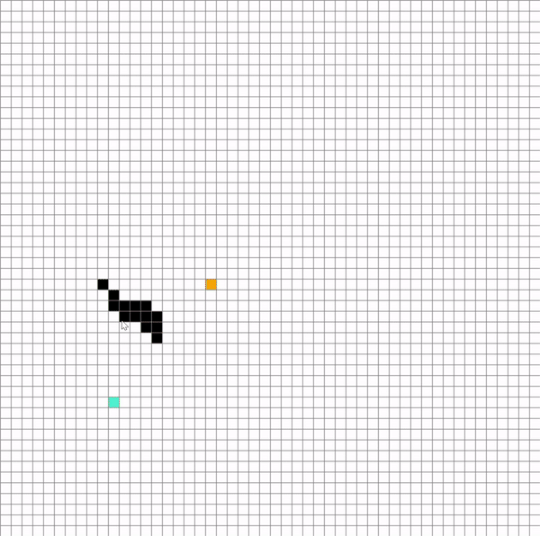

# Pathfinding Visualizer - 

KEYS:  
- Left mouse click = the first click marks the START point, the second click marks the END point and every following click is a barrier  
- Right mouse click = clear this point    
- SPACE = RUN the algorithm     

## A* algorithm
  

### About A* Search Algorithm
https://www.geeksforgeeks.org/a-search-algorithm/

## BFS algorithm

### About BFS Search Algorithm
https://www.geeksforgeeks.org/breadth-first-search-or-bfs-for-a-graph/